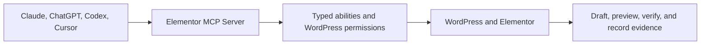

# Elementor MCP Server for WordPress - AI Website Builder & Automation


The open-source **Elementor MCP Server for WordPress**. Connect Claude,
ChatGPT, Codex, Cursor, and other AI agents to Elementor to build, edit,
inspect, and automate WordPress websites through the Model Context Protocol
(MCP).

<p align="center">
  <a href="https://github.com/wpFelix/elementor-mcp-server/releases/latest"></a>
  <a href="https://github.com/wpFelix/elementor-mcp-server/actions/workflows/ci.yml"></a>
  <a href="https://github.com/wpFelix/elementor-mcp-server/stargazers"></a>
  <a href="https://github.com/wpFelix/elementor-mcp-server/releases"></a>
  
  
  
  
  <a href="LICENSE"></a>
</p>

<p align="center">
  <a href="https://github.com/wpFelix/elementor-mcp-server/releases/latest/download/elementor-mcp.zip"></a>
</p>

<p align="center">
  <a href="https://elementormcp.com">Documentation</a> |
  <a href="#download-and-install">Installation</a> |
  <a href="#elementor-mcp-server-features">Features</a> |
  <a href="#what-you-can-ask-an-ai-agent-to-do">Examples</a> |
  <a href="#connect-claude-chatgpt-codex-cursor-and-other-mcp-clients">AI client setup</a> |
  <a href="https://elementormcp.com/elementor-mcp-pro/">Pro</a>
</p>

Build and manage Elementor websites with Claude, ChatGPT, Codex, Cursor, and
other MCP-compatible AI agents.

- **Open source:** GPL-2.0-or-later WordPress plugin with public source, tests,
  release workflows, and checksums.
- **WordPress MCP Server:** Typed content, media, settings, diagnostics, and
  controlled administration workflows.
- **Elementor MCP:** 41 Elementor Core abilities included in Free.
- **Production-safe permissions:** WordPress capabilities, typed schemas,
  safety profiles, rate limits, and explicit confirmations.
- **Change evidence and rollback:** Redacted before and after evidence with
  verified rollback where the operation supports it.
- **Elementor 4 support:** Compatible Atomic Elements, Global Classes, and
  Variables when the installed Elementor version exposes them.
- **Prompt library:** 10 detailed Free industry prompts and more than 300
  specialized Pro prompts.

> Install the attached `elementor-mcp.zip` release asset. GitHub's automatically
> generated "Source code" archives are development snapshots, not installable
> WordPress plugin packages.

## Model Context Protocol for Elementor and WordPress

Elementor MCP applies the Model Context Protocol for WordPress and the Model
Context Protocol for Elementor through a typed, permission-aware server. It can
be used as an AI Elementor builder, an AI WordPress builder, an Elementor automation layer,
or a WordPress automation layer without giving an agent unrestricted access by
default.



The AI client discovers the abilities available to its authenticated WordPress
user, reads live schemas, inspects the current document, performs the approved
operation, and returns structured evidence. The active safety profile can block
the operation before execution.

### Example Elementor AI workflow

Give your connected AI agent this request:

```text
Build a premium SaaS landing page in Elementor with a hero, product workflow,
features, pricing, proof, FAQ, and final CTA. Create a coherent design system,
use native Elementor containers and widgets, keep the page as a draft, and
verify desktop, tablet, and mobile behavior before asking for publication.
```

The expected path is:

1. Claude, ChatGPT, Codex, Cursor, or another client discovers the live tools.
2. Elementor MCP checks the WordPress user, safety profile, and input schema.
3. The agent inspects the site, theme, Elementor version, and existing content.
4. The agent creates or edits native Elementor data as a draft.
5. The result is previewed and reviewed with returned change evidence.

## What you can ask an AI agent to do

These are realistic starting requests. Available actions still depend on the
connected user's permissions, enabled abilities, safety profile, Elementor
version, and installed integrations.

### Build an Elementor website

```text
Build a premium seven-page website for a dental clinic using Elementor. Create
a consistent design system and reusable global styles. Use only verified
business facts and leave missing claims clearly marked for confirmation.
```

### Modify an existing page

```text
Inspect the current homepage and redesign the hero while preserving the
existing content, links, forms, tracking, and Elementor editability.
```

### Fix responsive Elementor design

```text
Audit this Elementor page for tablet and mobile problems. Explain the issues,
fix approved layout and overflow defects, and verify representative widths.
```

### Work with Elementor 4 Atomic Elements

```text
Inspect this component and convert it to compatible Elementor Atomic Elements
and reusable Global Classes without changing its visible content.
```

### Manage WordPress structure

```text
Create draft Services pages, organize the navigation structure, and assign
approved featured images. Do not publish anything until I review it.
```

### Run a WordPress SEO workflow

```text
Audit this landing page and update only the SEO metadata supported by the
installed SEO integration. Do not invent schema facts or promise rankings.
```

### Build a WooCommerce landing page

```text
Inspect the authoritative WooCommerce catalog and create a draft Elementor
landing page for this product category. Preserve real prices, stock, product
links, shipping facts, and return terms.
```

### Inspect before maintenance

```text
Inspect the site for configuration, performance, and content problems. Explain
what should be fixed and request approval before making any changes.
```

## Why Elementor first

Elementor MCP is designed to be the Elementor MCP Server for AI agents, not a
generic adapter for every page builder. Elementor is the only page-builder
integration in this repository. That focus allows the Free plugin to include a
deep native workflow for documents, containers, widgets, templates, global
styles, Atomic Elements, Global Classes, and Variables.

WordPress remains the foundation underneath. Content, media, taxonomies,
comments, revisions, menus, settings, diagnostics, and compatible non-builder
integrations remain available when their requirements are present.

The stable product identity is:

- Product: **Elementor MCP**
- Website: [ElementorMCP.com](https://elementormcp.com)
- GitHub: `wpFelix/elementor-mcp-server`
- Primary term: **Elementor MCP Server**
- Secondary term: **WordPress MCP Server**

## Elementor MCP server features

The Free plugin registers 41 Elementor Core abilities through a shared typed
runtime:

- Inspect Elementor setup, version compatibility, documents, templates, page
  structure, widget schemas, global styles, classes, and variables.
- Create draft pages and build native Elementor container and widget trees.
- Edit, move, duplicate, and remove elements with schema-aware operations.
- Read and apply templates and manage compatible global design settings.
- Work with Elementor 4 Atomic Elements, Global Classes, and Variables when the
  installed Elementor version exposes them.
- Protect Elementor-owned documents from ordinary raw WordPress content writes.
- Preview consequential operations where available, then return change evidence
  for review.

No alternate page-builder adapter, loader, skill, or ability is shipped.

## WordPress MCP server features

The Free plugin also exposes a typed WordPress core surface:

- Posts, pages, supported custom post types, terms, media, comments, revisions,
  and navigation menus.
- User reads and carefully allowlisted WordPress settings.
- Plugin and theme search, inspection, activation, deactivation, updates, and
  other lifecycle operations according to the active safety profile.
- Health, configuration, performance, and scoped security diagnostics.
- MCP resources, prompts, reusable skills, design context, and controlled
  developer operations.
- Optional forms, SEO, custom-field, commerce, localization, and theme
  integrations that load only when their required modules and plugins exist.

Creation is draft-first. Publishing requires an explicit published status and
the connected WordPress user's matching capability.

## Connect Claude, ChatGPT, Codex, Cursor, and other MCP clients

After activation, open **Elementor MCP > Connect** in WordPress. Choose the
client first, then use the exact URL and authentication method generated for
that site. The examples below contain placeholders and must not be copied with
real secrets into a repository.

### Claude Elementor and Claude WordPress setup

For Claude Code with an access token, the Connect screen generates a command in
this shape:

```bash
claude mcp add --transport http elementor-mcp <YOUR_GENERATED_MCP_URL> --header "Authorization: Bearer <YOUR_TOKEN>" --scope user
```

Restart Claude Code after adding the server. Claude Desktop can use the
generated `claude_desktop_config.json` or the guided connector flow. Claude on
the web requires a publicly reachable HTTPS site.

### ChatGPT Elementor setup

ChatGPT uses OAuth rather than a fixed Authorization-header field:

1. Make the WordPress site reachable over public HTTPS.
2. Open **ChatGPT > Settings > Apps > Advanced settings**.
3. Enable Developer mode and choose **Create app**.
4. Paste the OAuth MCP URL generated by **Elementor MCP > Connect**.
5. Complete the browser consent flow with the intended WordPress account.

### Codex Elementor setup

For Codex CLI with an access token, add the generated values to
`~/.codex/config.toml` on macOS or Linux, or
`%USERPROFILE%\.codex\config.toml` on Windows:

```toml
[mcp_servers.elementor-mcp]
url = "<YOUR_GENERATED_MCP_URL>"

[mcp_servers.elementor-mcp.http_headers]
Authorization = "Bearer <YOUR_TOKEN>"
```

For OAuth, follow the Connect screen and run `codex mcp login` after adding the
server. The Codex desktop app uses its remote MCP settings and OAuth browser
sign-in.

### Cursor Elementor setup

For Cursor, add the generated access-token configuration to `~/.cursor/mcp.json`
or the project's `.cursor/mcp.json`:

```json
{
  "mcpServers": {
    "elementor-mcp": {
      "type": "http",
      "url": "<YOUR_GENERATED_MCP_URL>",
      "headers": {
        "Authorization": "Bearer <YOUR_TOKEN>"
      }
    }
  }
}
```

Cursor can also use OAuth. Complete its browser sign-in when it reports that the
server needs authentication.

### Other supported clients

The built-in registry also provides client-specific guidance for Claude
Desktop, Claude on the web, VS Code, GitHub Copilot, Gemini CLI, Qwen Code,
Kimi Code CLI, Factory Droid, Mistral Le Chat, Perplexity, Manus, Zed, Cline,
OpenCode, and other compatible remote MCP clients.

Configuration shapes differ. VS Code nests entries under `servers`; Gemini CLI
and Qwen Code use `httpUrl`; some editors use `serverUrl`; and hosted web clients
require public HTTPS. Use the generated client-specific configuration instead
of changing field names by guesswork.

## Requirements

| Component | Requirement |
| --- | --- |
| WordPress | 6.9 or newer |
| PHP | 8.0 or newer |
| Elementor | 3.6 or newer for Elementor workflows |
| Remote connections | HTTPS strongly recommended and required for OAuth |
| License | GPL-2.0-or-later |

Elementor is optional for WordPress core operations. Activating a compatible
Elementor version unlocks the 41-ability page-building surface.

## Download and install

1. [Download the latest stable `elementor-mcp.zip`](https://github.com/wpFelix/elementor-mcp-server/releases/latest/download/elementor-mcp.zip).
2. In WordPress, open **Plugins > Add New Plugin > Upload Plugin**.
3. Upload `elementor-mcp.zip`, install it, and activate Elementor MCP.
4. Install and activate Elementor if you want to use the Elementor abilities.
5. Open **Elementor MCP > Connect** in WordPress.
6. Choose your AI client and authentication method, then copy the generated
   connection details.
7. Keep **Production Safe** enabled for ordinary site work.

The public release includes a matching SHA-256 checksum. Use the release asset,
not GitHub's generated source archive.

## Authentication methods

| Method | Best for | Notes |
| --- | --- | --- |
| OAuth | Modern clients with browser sign-in | Uses consent, expiring credentials, refresh tokens, revocation, and a dedicated OAuth MCP route. |
| Access token | Clients that can send a Bearer token | Tokens are shown once, stored as hashes, can expire, and can be revoked. |
| Application Password | Clients that support HTTP Basic authentication | Uses WordPress's per-user Application Password system. |

For a safe first session:

1. Connect with **Production Safe** enabled.
2. Discover the abilities available to the authenticated WordPress user.
3. Read the live input schema for the target ability.
4. Inspect the existing page or template before changing it.
5. Preview the operation when a preview is available.
6. Apply only the approved change and review its returned evidence.

The server uses the WordPress Abilities API and bundles the official WordPress
MCP Adapter. It supports the documented legacy and modern MCP protocol paths
while applying the same authorization and safety controls to both.

## Safety and change control

| Profile | Intended use | Mutation policy |
| --- | --- | --- |
| Production Safe | Normal content, design, SEO, form, and commerce work | Allows ordinary operations while blocking critical developer primitives. Destructive allowed operations require explicit confirmation. |
| Read Only | Audits, discovery, reporting, and support | Blocks every mutation, including rollback. |
| Developer Full Access | Deliberate development or recovery work | Permits manually enabled critical abilities. Critical and destructive calls still require confirmation. |

Every state-changing ability is checked against the connected WordPress user's
capabilities and its declared schema. The bounded change ledger redacts secrets,
records before and after fingerprints, attributes writes to the agent
credential, and offers rollback only for operations that can be safely verified.
Irreversible actions are recorded as non-reversible.

Read the full [safety model](docs/SAFETY.md) before granting development access.

## Free industry prompt library

Free includes exactly 10 detailed Elementor homepage prompts:

| Industry | Prompt focus |
| --- | --- |
| Restaurant and Cafe | Menu accuracy, dietary process, reservations, hours, location, and original food photography |
| Dental Clinic | Verified clinicians, treatments, fees, accessibility, patient process, and responsible clinical claims |
| Law Firm | Jurisdiction, named lawyers, credentials, practice areas, consultation flow, and legal disclaimers |
| Real Estate Agency | Buyer, seller, rental, listing, agent, service-area, and valuation journeys |
| Fitness Studio | Classes, trainers, facilities, schedules, memberships, accessibility, and non-misleading outcome claims |
| Home Services | Service radius, real projects, credentials, process, workmanship terms, and quote flow |
| Nonprofit and Community | Programs, sourced impact, governance, safeguarding, reports, donations, and volunteering |
| Education and Training | Curriculum, instructors, prerequisites, workload, delivery, fees, support, and outcome boundaries |
| E-commerce and Retail | Product data, media, stock, price, shipping, returns, reviews, support, and buying guidance |
| SaaS and Software | Real workflows, screenshots, integrations, security evidence, pricing, documentation, and demos |

Each prompt includes discovery, an industry fact contract, section architecture,
a design system, media rules, accessibility, responsive behavior, performance,
safe draft construction, verification, and handoff requirements. Missing facts
must remain explicit instead of being invented by the AI client.

## Free and Pro

| Capability | Free | Pro |
| --- | --- | --- |
| MCP transport and authentication | Included | Uses Free |
| Safety profiles, approvals, and change evidence | Included | Extended workflows use the same controls |
| WordPress core abilities | Included | Uses Free |
| Elementor Core abilities | 41 included | Uses and extends the Free runtime |
| Elementor 4 Atomic Elements, Classes, and Variables | Included when available | Extended advanced workflows |
| Industry prompt library | 10 detailed prompts | More than 300 specialized prompts |
| Advanced specification reconstruction | Not included | Included |
| Dynamic content and display conditions | Not included | Included |
| Popups, forms and submissions, custom code, interactions, and SVG upload | Not included | Included |

Elementor MCP Pro depends on the Free plugin and is not included in this public
repository. See [Elementor MCP Pro](https://elementormcp.com/elementor-mcp-pro/)
for the product overview.

## Project history and release quality

Follow meaningful public development through the
[commit history](https://github.com/wpFelix/elementor-mcp-server/commits/main),
[changelog](CHANGELOG.txt), and
[tagged releases](https://github.com/wpFelix/elementor-mcp-server/releases).
Do not infer maturity from an artificial commit count; releases and commits are
kept as real project history.

Tagged releases are built by GitHub Actions. The release workflow runs the
repository tests and static verification, builds the dashboard assets, creates
the installable plugin ZIP, and publishes its SHA-256 checksum. A passing build
is repository-level evidence, not a guarantee for every hosting stack,
third-party plugin combination, or production site.

Every public release should clearly identify what changed, what was improved or
fixed, security or compatibility notes where applicable, the installable ZIP,
its checksum, and any required upgrade steps.

## Frequently asked questions

### Is Elementor MCP a WordPress MCP server?

Yes. Elementor MCP installs as a WordPress plugin and exposes typed WordPress
abilities through the Model Context Protocol. The available operations still
depend on the connected user's WordPress capabilities, enabled abilities,
active safety profile, and installed integrations.

### Is this an Elementor MCP server?

Yes. Free includes 41 Elementor Core abilities for document inspection, page
building, element editing, templates, global styles, and compatible Elementor 4
Atomic features.

### Is Elementor MCP an AI agent for WordPress or Elementor?

Elementor MCP is the governed connection layer, not the AI model. It lets a
compatible AI agent for WordPress or AI agent for Elementor use typed tools
under WordPress permissions and the active safety profile.

### Does Elementor have to be installed?

Only for Elementor-specific workflows. WordPress core, diagnostics, skills, and
compatible non-builder integrations can remain available without Elementor.

### Can an AI agent publish or delete content automatically?

Content creation defaults to draft. Publishing needs an explicit published
status and the matching WordPress capability. Destructive operations that are
allowed by the active profile require explicit confirmation.

### Which ZIP should I install?

Install `elementor-mcp.zip` from the latest GitHub Release. Do not install the
automatically generated "Source code" ZIP or tarball.

## Development and contribution

The repository contains PHP source, TypeScript dashboard source, bundled
dependencies, tests, skills, prompt packs, documentation, packaging scripts,
and release workflows. Run the repository verification scripts before creating
a release ZIP. Do not commit credentials, production exports, or generated local
state.

See [CONTRIBUTING.md](CONTRIBUTING.md) for contribution guidance and
[SECURITY.md](SECURITY.md) for private vulnerability reporting.

## License

Elementor MCP is licensed under
[GPL-2.0-or-later](LICENSE). Product documentation is available at
[ElementorMCP.com](https://elementormcp.com).
